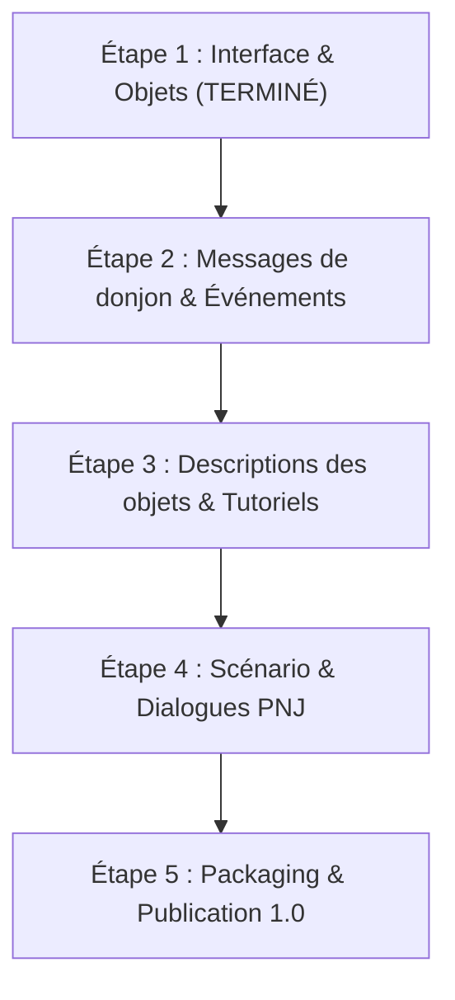

# Guide Steam & Plan d'Action — Traduction Française
*Dragon Quest Heroes: Torneko's Mystery Dungeon -Classic HD-*

---

## I. Plan d'action pour la suite du projet

Voici la feuille de route méthodique pour mener la traduction à 100% lors des prochaines sessions :



### Détail des étapes restantes :

| Phase | Fichier Radec | Contenu | Volume | Statut |
| :--- | :--- | :--- | :--- | :--- |
| **Phase 1** | `287453834` & `1290896954` | Menus, UI, Commandes, Écran-titre, Liste des 90 objets | 342 entrées | **Validé en jeu** ✅ |
| **Phase 2** | `568064241.bin` | Journal de combat en donjon *(attaques, sorts, pièges, effets)* | 294 lignes | *Prêt à traduire* |
| **Phase 3** | `1557199733.bin` & `1630491760.bin` | Descriptions complètes des objets + Guides & Astuces | 280 entrées | *À venir* |
| **Phase 4** | `353109016.bin` | Scénario complet, scènes cinématiques et dialogues des villageois | 544 répliques | *À venir* |
| **Phase 5** | Packaging `.zip` | Création de l'archive finale distribuable + installateur en 1 clic | 1 pack final | *À venir* |

> [!NOTE]
> Tous les scripts du pipeline de reverse-engineering (`build_french_mod.py`, `repack_main_game_pak.py`, clés AES, structures de chiffrement d'index) sont sauvegardés localement. Vous pourrez reprendre exactement là où nous nous sommes arrêtés sans refaire aucune étape technique.

---

## II. Guide Steam de la Communauté (Prêt à copier-coller)

*Vous pouvez copier l'encadré ci-dessous directement dans l'éditeur de Guide Steam. Il utilise les balises BBCode officielles reconnues par Steam.*

```bbcode
[h1]Dragon Quest : Torneko - Patch de Traduction Française Intégrale (PC)[/h1]

[b]Ce guide vous permet d'installer facilement le mod de traduction française pour Dragon Quest Heroes: Torneko's Mystery Dungeon -Classic HD- sur Steam.[/b]

Ce projet est une fan-traduction bénévole créée avec passion pour permettre à tous les joueurs francophones de découvrir ce chef-d'œuvre du dungeon-crawler rétro dans des conditions optimales !

[hr][/hr]

[h1]🌟 Fonctionnalités du Patch FR[/h1]
[list]
[*] [b]Menus & Interface 100% en Français[/b] (Écran-titre, options, commandes, fenêtres de stats).
[*] [b]Nomenclature officielle Dragon Quest FR[/b] (Épée de mercure, Parchemin Décuplo, Aile de chimère, Herbe médicinale...).
[*] [b]Typographie rétro optimisée[/b] adaptée à l'écran et au moteur du jeu, sans coupure de mots ni débordement.
[*] [b]Installation simple et sans risque[/b] : aucun fichier système n'est altéré, désinstallation en un clic.
[/list]

[hr][/hr]

[h1]📥 Téléchargement du Mod[/h1]

Téléchargez la dernière version du patch ici :
👉 [url=https://github.com/Edsaje/French_Trad_Dragon_Quest_Heroes_Torneko-s_Mystery_Dungeon_-Classic-HD-/raw/main/patch/TornekosMysteryDungeon-Windows_Patch_FR_v0.5_Beta.zip][b]Télécharger le Patch Français (Archive ZIP avec Installateur)[/b][/url]
👉 [url=https://github.com/Edsaje/French_Trad_Dragon_Quest_Heroes_Torneko-s_Mystery_Dungeon_-Classic-HD-][b]Consulter le Dépôt GitHub du Projet[/b][/url]

[hr][/hr]

[h1]🛠️ Instructions d'Installation (30 secondes)[/h1]

[olist]
[*] Ouvrez votre bibliothèque Steam.
[*] Faites un clic droit sur [b]Dragon Quest Heroes: Torneko's Mystery Dungeon[/b] > [b]Gérer[/b] > [b]Parcourir les fichiers locaux[/b].
[*] Ouvrez le dossier :
[code]TornekosMysteryDungeon \ Content \ Paks[/code]
[*] [b](Optionnel mais conseillé)[/b] Renommez le fichier existant [i]TornekosMysteryDungeon-Windows.pak[/i] en [i]TornekosMysteryDungeon-Windows.pak.bak[/i] pour garder une sauvegarde de secours.
[*] Copiez le fichier [b]TornekosMysteryDungeon-Windows.pak[/b] téléchargé dans ce dossier.
[*] Lancez le jeu via Steam en mettant la langue du jeu en [b]Anglais[/b] dans les options.
[*] Le jeu est désormais en français ! 🎉
[/olist]

[h2]Comment désinstaller le patch ?[/h2]
Pour revenir au jeu d'origine, supprimez simplement le fichier [i]TornekosMysteryDungeon-Windows.pak[/i] et restaurez votre sauvegarde, ou faites un clic droit sur le jeu dans Steam > [b]Propriétés[/b] > [b]Fichiers installés[/b] > [b]Vérifier l'intégrité des fichiers du jeu[/b].

[hr][/hr]

[h1]☕ Soutenir le projet (100% Gratuit & Bénévolat)[/h1]

Ce mod est et restera [b]100% gratuit[/b] pour toute la communauté.

Si vous appréciez le travail de rétro-ingénierie et de localisation réalisé sur ce jeu, vous pouvez soutenir le projet avec un petit pourboire ou un café :
👉 [b]Lien de soutien (Tipeee / Ko-fi / PayPal) :[/b] [url=https://ko-fi.com/VOTRE_PSEUDO]https://ko-fi.com/VOTRE_PSEUDO[/url]

[hr][/hr]

[h1]🦉 Retrouvez-moi sur YouTube : Hibouxe ![/h1]

Rejoignez la chaîne YouTube [b]Hibouxe[/b] pour du contenu sur les jeux rétro, des guides, du gameplay et suivre l'avancée de nos futurs projets de traduction !

👉 [b]Abonnez-vous à la chaîne :[/b] [url=https://www.youtube.com/@Hibouxe][b]YouTube @Hibouxe[/b][/url]

N'hésitez pas à laisser un pouce bleu 👍 et à ajouter ce guide dans vos favoris ⭐ pour aider d'autres joueurs à découvrir la traduction !
```

---

## III. Fichiers prêts à l'emploi sur votre machine

Votre version actuelle corrigée et prête à être distribuée se trouve à cet emplacement :
* **Fichier patch prêt pour diffusion :**
  `E:\SteamLibrary\steamapps\common\TornekosMysteryDungeon\TornekosMysteryDungeon\Content\Paks\TornekosMysteryDungeon-Windows.pak`
* **Sauvegarde de secours d'origine :**
  `E:\SteamLibrary\steamapps\common\TornekosMysteryDungeon\TornekosMysteryDungeon\Content\Paks\TornekosMysteryDungeon-Windows.pak.original_backup`
